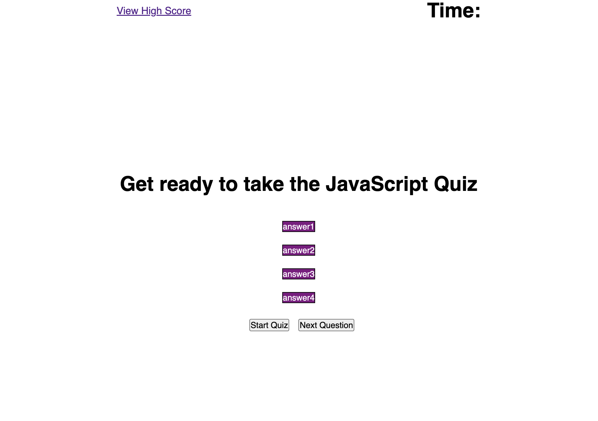

# javascript-quiz

## Description

The purpose of this project is to create a coding quiz using JavaScript. 

## Goal

### User Story

AS A coding boot camp student
I WANT to take a timed quiz on JavaScript fundamentals that stores high scores
SO THAT I can gauge my progress compared to my peers

### Acceptance Criteria

GIVEN I am taking a code quiz
WHEN I click the start button
THEN a timer starts and I am presented with a question
WHEN I answer a question
THEN I am presented with another question
WHEN I answer a question incorrectly
THEN time is subtracted from the clock
WHEN all questions are answered or the timer reaches 0
THEN the game is over
WHEN the game is over
THEN I can save my initials and score

## Installation

In order to view the code quiz, you will need to visit the live deployment URL: https://ajcodes-cyber.github.io/javascript-quiz/

## Usage

## Credits

* I referenced a YouTube video by Web Dev Simplified (https://www.youtube.com/watch?v=riDzcEQbX6k)
* Worked with Tanner Ruminer on this homework

## License

No License necessary

## Features

Semantic tagging was used in html file to adhere to accessibility needs.
